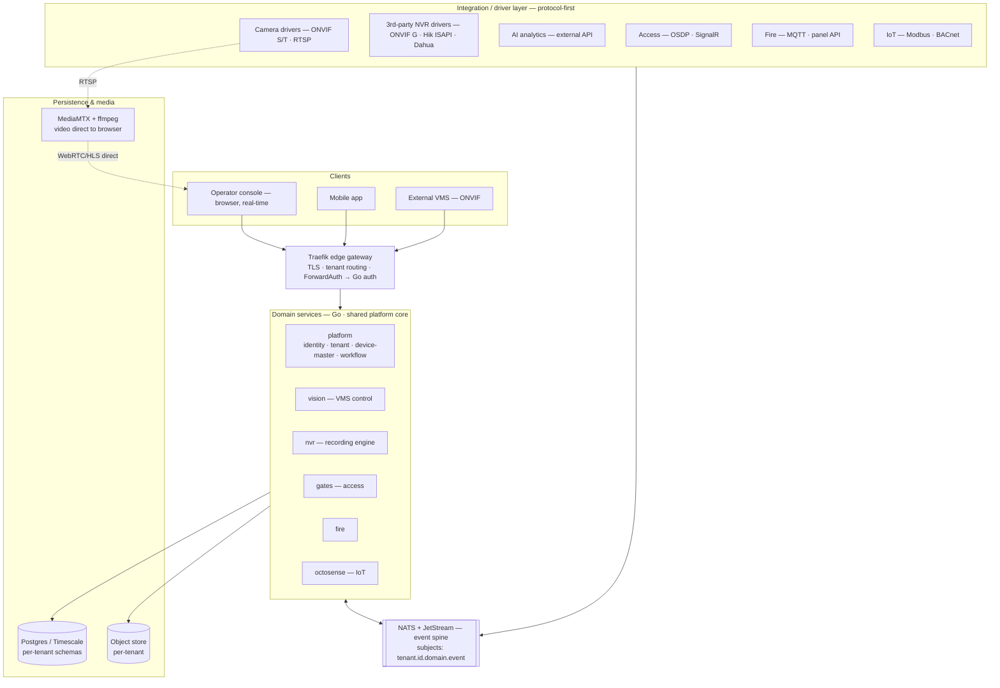

# Neubit v3 — Target Architecture

> Status: design (no code yet). This is the canonical architecture for the v3 rebuild:
> an all-Go, protocol-first, event-driven, multi-tenant physical-security **command
> center** that unifies VMS (live + recording), third-party NVR management, access
> control, fire, and IoT — with AI delivered as an external API integration.

---

## 1. What we are building

A command center / PSIM (Physical Security Information Management) platform. One core,
many device domains (cameras, NVRs, doors, fire panels, sensors), one operator console,
one event spine.

**Language strategy — polyglot by plane (not "rewrite everything in Go").** Because every
service talks only over the gateway + NATS (a network contract, not FFI), each service's
language is a free, reversible choice. We split by plane:

- **Control plane = Python / FastAPI (reuse the mature investment).** The `platform_base`
  `edge` package is used **as the platform core** (auth · RBAC · 2FA · licensing · messaging
  · reports · storage · settings · branding · audit · module registry). The mature v2
  control/integration services — `platform`, `gates`, `fire`, `octosense`, `vision`-control —
  stay FastAPI: they are CRUD + moderate load, they already work, and rewriting working code
  is waste.
- **Data plane = Go (where speed/memory actually matter).** The **NVR recording engine**,
  media orchestration, high-throughput real-time event processing, 512-ch-scale pieces, and
  connection-dense adapters. This is exactly where Python's memory/GC bit us — so this is
  where Go pays off. `gvd_nvr → Go` is the highest-value port.

The decision criterion is **plane/workload, not maturity.** "It works well" is not a reason
to keep the data plane in Python — the NVR engine is mature *and* performance-critical, and
it is the top candidate to move to Go. Drivers are polyglot too (see §5).

### Deployment editions (same codebase, two shapes)

| Edition | Tenancy | For | Notes |
|---|---|---|---|
| **Cloud** | Multi-tenant SaaS | Smaller clients (typically < 200 channels) | Site connects out via a light edge connector; central console. |
| **On-prem** | Single-tenant | Large clients (e.g. the 512-channel order), govt/enterprise | Hardware appliance / multi-node servers at the client site. |

**Key principle: one architecture, deploy either way.** An on-prem install is just "one
tenant in the cell model." The multi-tenant control plane serves cloud; the same code with
one tenant serves on-prem. We do not fork the product per edition.

---

## 2. Core principles

1. **Protocol-first integration** (see §5) — standards before vendor APIs before brand
   quirks. This is what lets us add VMS, IoT, access control, fire "for free" as new
   drivers behind one normalized contract.
2. **Event-driven + loosely coupled** — services communicate only through the **NATS**
   event spine, never by direct service-to-service HTTP. Real-time by push, not polling.
   (v2's `vision → nvr` sync HTTP + 5s polling is removed.)
3. **Control plane / data plane split** — metadata/events/commands flow through the
   platform; **video never transits the bus or the API** — it goes camera → media server →
   browser directly.
4. **Multi-tenant by design** — `tenant_id` on every identity, event subject, and data
   partition. Video and recordings are per-tenant isolated.
5. **One shared Go platform core** — auth, tenant resolution, RBAC, licensing, audit,
   settings, messaging, storage — a library every service imports (converges v2's
   `neubit-common` + platform_base `edge`).

---

## 3. High-level architecture

Request/command flows down through Traefik into the Go services. All cross-domain
communication is events on NATS. The driver layer turns any device/brand into normalized
events on the bus. Video is a separate direct plane.

---

## 4. The event spine (NATS + JetStream)

- **Subjects:** `tenant.<tenant_id>.<domain>.<event>` — e.g.
  `tenant.acme.fire.zone_alarm`, `tenant.acme.camera.motion`, `tenant.acme.access.door_forced`.
  Tenant isolation is enforced at the subject level (a tenant never subscribes across `tenant.*`).
- **JetStream** provides durability + replay where needed (at-least-once delivery, consumer
  acks). Ephemeral real-time subjects use core NATS.
- **Request-reply** for the rare genuine sync need (e.g. "current PTZ position") — still no
  service discovery or coupling.
- **Event history / analytics** persisted to **Timescale** hypertables (keeps the
  durable-log benefit we would have lost by dropping Kafka).

Example — fire alarm, fully event-driven and real-time:
`fire driver → tenant.T.fire.zone_alarm → NATS →` (workflow runs SOP) + (vision pulls
zone cameras) + (WS gateway pushes to console) + (Timescale stores) + (notifications).
No service calls another directly.

---

## 5. Integration / driver layer (protocol-first) — the heart of the platform

Every external system is a **driver** behind a normalized internal interface. Drivers
resolve capabilities in this order:

1. **Protocol first** — open standards: **ONVIF** (Profile S live, **Profile G**
   recording/replay/export, Profile T, PullPoint events), **OSDP** (access), **BACnet /
   Modbus** (IoT), RTSP, MQTT. One driver covers many brands.
2. **API second** — vendor REST/gRPC: Hikvision ISAPI, Dahua HTTP API, an **external AI
   analytics API**, etc. — when the standard doesn't cover it.
3. **Brand-specific way last** — proprietary SDK / quirk handling, only when nothing else
   works.

Drivers implement **capability interfaces**, and the core only ever talks capabilities —
never a brand:

- `Discoverable` (find devices), `Streamable` (live), `Recordable` / `Exportable`
  (recording + footage export), `EventSource` (push events), `PTZ`, `Telemetry`,
  `AccessControl`, `Health`.
- A device advertises which capabilities it supports; the platform composes features from
  capabilities. Adding a new brand/protocol = write a driver; the rest of the platform is
  untouched.

This is what makes "support live VMS, IoT, access control, fire easily" true: they are all
just sets of drivers behind the same contract, publishing normalized events to NATS.

### Drivers are polyglot (sidecars are first-class, not a compromise)

A driver is *any process* that implements the capability contract and publishes normalized
events — the language is irrelevant. Most drivers are Go; where another ecosystem is
clearly better, the driver is a small sidecar behind the same contract (gRPC / NATS):

- **BACnet** (IoT protocol) → **Python sidecar driver** (BAC0/bacpypes3). BACnet is a
  recurring standard protocol with no mature Go stack, so a proper Python driver is the
  right call — it sits in the protocol tier, just implemented in Python.
- **SignalR** (used to integrate one access-control brand) → thin **Go driver**
  (`philippseith/signalr`) or a small sidecar. This is a *brand-specific* integration
  (tier 3), narrow and isolated — one brand, one driver.

The Go core stays pure; drivers live at the edge in whatever language fits. This keeps the
protocol-first model honest without forcing every protocol into Go.

---

## 6. The 512-channel order — how it maps

| Requirement | How it's delivered |
|---|---|
| Camera **recording** (512 ch) | `nvr` service, multi-node sharded (64–128 ch/node × N nodes), MediaMTX/ffmpeg per node, per-tenant storage. |
| Central **monitoring** | `vision` VMS control plane + operator console video wall; node registry + health in the control plane. |
| Camera **events** | Camera driver via **ONVIF PullPoint** → normalized events on NATS. |
| **AI analytics** (3rd-party cameras) | **External AI API** driver — sends streams/frames to the client's/vendor's AI API, receives detections, publishes as `*.analytics.*` events. AI is an integration, not core. |
| **3rd-party NVR management** | NVR drivers (see §7) — health, recording access, **footage export** across mixed brands. |

**Storage reality:** 512 ch × ~648 GB/cam/month (2 MP H.265) ≈ **330 TB/month** at 30-day
retention. Plan hardware/retention/H.265+ per camera tier — this is a BoM + policy decision,
not overhead.

---

## 7. Third-party NVR integration (high market demand)

Clients already own NVRs of many brands and want to manage them from our platform:
**health, recording access, and footage export** — without ripping out their DVRs/NVRs.

Delivered by **NVR drivers** in the integration layer, protocol-first:
1. **ONVIF Profile G** (recording search / replay / export) — covers any compliant NVR.
2. **Vendor API** — Hikvision ISAPI, Dahua HTTP API, etc. for non-standard NVRs.
3. Normalized to `Recordable` + `Exportable` + `Health` capabilities, so the operator
   console shows a **unified timeline + export** across our own recordings and the client's
   existing NVRs — one UI, many brands.

This is a differentiator: we don't just record, we **manage the estate they already have.**

---

## 8. Frontend — modular monolith, NOT micro-frontends

**Recommendation: a single Next.js app (the platform_base Vercel theme), architected
modular internally — not micro-frontends.**

- Feature-modules per domain (`vms`, `access`, `fire`, `iot`, `workflow`, `admin`), each
  with its own screens + API hooks, **lazy-loaded**, gated by a backend-driven manifest
  (`/features` = licensed modules + permission-gated nav). Same pattern platform_base
  already uses (`menu.js` + module registry + 1-line route re-exports).
- This gives the *modularity* micro-frontends promise (per-domain ownership, license-gated
  loading, per-tenant/edition feature sets) **without** their cost (Module Federation build
  complexity, shared-dependency version hell, runtime integration bugs, design drift).
- Backend is microservices; frontend is a modular monolith. This asymmetry is correct and
  standard (most SaaS + Vercel/Linear do exactly this). Operators want **one coherent
  console**, not stitched-together apps.

**The one future trigger for micro-frontends:** if third parties/clients must inject their
own custom panels into the console **at runtime without rebuilding** (deep white-label /
plugin marketplace). Design the module seams cleanly now so we *can* extract one later —
**"modular now, federatable later"** — but don't pay the cost until that requirement is real.

---

## 9. Tech stack

| Concern | Choice |
|---|---|
| Language | **Polyglot by plane** — control plane Python/FastAPI (`edge` core + mature services), data plane Go (NVR/media/high-throughput) |
| Platform core | **`platform_base` `edge`** (Python) used as-is, + multi-tenancy + STQC controls |
| Edge gateway | **Traefik** (dynamic discovery; ForwardAuth → Go auth service) |
| Event spine | **NATS + JetStream** |
| DB | **Postgres + TimescaleDB** (per-tenant schemas; raw Timescale DDL via golang-migrate/atlas) |
| Object store | S3-compatible (per-tenant buckets) |
| Media | **MediaMTX + ffmpeg** (external; Go orchestrates via REST) — recording + **H.264 and H.265** + WebRTC/HLS + control API |
| Frontend (web) | **Next.js** (platform_base Vercel theme, JS) + TanStack Query, modular monolith |
| Desktop app | **Wails** (Go backend + reuse the web UI → native app) — see §14 |
| Observability | OpenTelemetry + Prometheus + Grafana |
| Secrets | SOPS + age |
| Drivers | Go; sidecars (Python for BACnet, etc.) behind the capability contract |

---

## 10. Multi-tenancy — DB-per-tenant (strong isolation)

Decision: **database-per-tenant** for the data plane (not shared tables, not just schemas).
Chosen for the strongest isolation story, which matters for STQC certification (§13),
enterprise/govt clients, and data residency.

- **Control plane = one shared DB + `tenant_id`**: tenant registry, global identity/auth,
  licensing, billing, branding.
- **Data plane = one database per tenant**: cameras, recordings, events, access, fire, IoT
  + per-tenant object-storage buckets + per-tenant media namespaces. Large/regulated tenants
  can get a dedicated Postgres instance. **Video/recordings never shared.**
- **Why DB-per-tenant:** per-tenant encryption keys + backup/restore, clean data residency,
  trivial tenant lifecycle (provision = create DB; offboard = drop DB), and a clear
  certification claim ("tenant data is physically separated"). On-prem is naturally a single
  tenant → a single DB, so on-prem and cloud share the exact same code path.
- **Operational cost is handled, not avoided:** automated per-tenant provisioning + a
  **migration runner** that applies migrations across all tenant DBs; per-tenant connection
  pools resolved at request time. Client counts are tens-to-hundreds (real installations,
  not consumer SaaS), so this scales comfortably. *(If tenant count ever explodes into the
  thousands, schema-per-tenant is the documented fallback.)*
- **Propagation:** `tenant_id` in the JWT → Traefik injects `X-Tenant-ID` → platform-core
  resolver routes to the tenant's database and scopes every query + NATS subject.

---

## 11. Migration approach (from v2)

Not a big-bang rewrite. Reuse the mature Python where it's good, build Go where it pays off,
behind stable gateway/JWT/NATS contracts (the gateway doesn't care what language a service is).

1. **Adopt `platform_base` `edge` as the single platform core** (Python). Retire the
   overlapping bits of v2's `neubit-common`; point all Python services at `edge`. Add
   multi-tenancy (tenant resolver + DB-per-tenant routing) and finish the STQC controls.
2. **Keep the mature control-plane services in FastAPI** — `platform`, `gates`, `fire`,
   `octosense`, `vision`-control — reworked to publish/consume NATS instead of sync HTTP +
   polling (this is what makes the system event-driven/real-time).
3. **Build the data plane in Go** — port the NVR recording engine from `gvd_nvr`, the media
   orchestration, and high-throughput real-time processing. This is the highest-value Go work.
4. **Drivers** land incrementally (Go, or sidecars) as brands/protocols are needed.

AI (Triton/scenarios) is removed; AI now enters only as an external-API driver. Everything
moves behind Traefik + NATS first, so language changes per service are independent and
reversible. If the Python auth hot-path ever becomes a bottleneck, extract just JWT-verify
(stateless) to Go — the rest of the core stays Python.

---

## 12. Decisions log (all resolved)

1. Media = **MediaMTX + ffmpeg** (recording + H.264/H.265 + WebRTC/HLS).
2. Drivers = **polyglot**; BACnet = Python sidecar, SignalR = thin Go driver / small sidecar.
3. Tenant isolation = **DB-per-tenant** (§10).
4. Deployment = **cloud multi-tenant + on-prem single-tenant, one codebase.**
5. Frontend = **modular monolith** (not micro-frontends); desktop via **Wails** (§14).
6. Gateway = **Traefik**; event bus = **NATS + JetStream**.

---

## 13. STQC / security certification (designed-in, not retrofitted)

The project targets **STQC certification** (MeitY ER:01 security bar for CCTV/security
systems in India). Certification is far cheaper built-in than retrofitted, so the **Go
platform core carries the full control set from day one** — and most of it already exists in
the v2 codebases (`platform_base` edge + vizor_nvr) to port faithfully:

- No default credentials (first-run setup) · forced password change · password policy +
  history + lockout · **TOTP 2FA**.
- **TLS everywhere** · **secrets encrypted at rest** (SOPS/age + per-tenant encryption keys)
  · encrypted device credentials.
- **RBAC** (permission-catalog) · **hash-chained audit log** · session revocation.
- **Signed updates / firmware** · disabled debug ports in release · **SBOM +
  dependency-audit** in CI · published vulnerability-disclosure policy.
- DPDP-style data rights (export/erase) — DB-per-tenant makes per-tenant erase trivial.

**Certification target = the on-prem single-tenant appliance** (STQC certifies a product).
The multi-tenant cloud inherits the same hardened core, and **DB-per-tenant** strengthens the
isolation claim. This reuses the STQC/ER:01 groundwork already done in the earlier codebases.

---

## 14. Super-admin panel (separate, cross-tenant)

A separate management console for the platform vendor/operator — manages **tenants,
licenses, and feature access across all tenants**, distinct from the per-tenant operator
console. Required (as in neubit_v2, now made truly cross-tenant by multi-tenancy).

- **Backend:** `/api/admin/*` in `core`, on the control-plane DB only (never per-tenant data):
  tenant lifecycle (create → provision DB → seed; suspend; offboard → drop DB), per-tenant
  Ed25519 license issuance/assignment (tier/limits/expiry), per-tenant feature/module
  entitlement (ties to `edge/core/modules.py` + `license.py`), cross-tenant audit, support
  impersonation (audited), plans/billing.
- **Auth isolation (critical for STQC + multi-tenant):** a **separate super-admin realm** —
  own JWT audience (`aud=neubit-admin`), own login; tenant users can never reach it.
  Optionally network-isolated (internal/VPN or IP-allowlist) + separate subdomain. The
  license **signing key stays offline / in a separate signing service** — the panel never
  holds the vendor private key.
- **Frontend:** `admin-frontend/` — a **separate Next.js app** (same Vercel theme/kit, own
  auth + routes). On-prem (single-tenant) needs only a minimal local admin; the cross-tenant
  panel matters for the **cloud** edition.

## 15. Desktop application

A native desktop operator client is required (alongside browser + mobile). It is **just
another client of the same protocol-first backend** — same Traefik API + NATS events + direct
MediaMTX video — so it changes nothing in the backend architecture.

- **Recommended: Wails** (Go backend shell + **reuse the web UI** via native webview) — fits
  the Go stack, one UI codebase serves web + desktop, small native binary (no bundled
  Chromium like Electron).
- **On-prem win:** a desktop client on the operator LAN pulls video **directly from the
  on-site MediaMTX** (low latency, no cloud round-trip) and can do local recording/export.
- **Caveat:** a very dense local video wall (many simultaneous GPU-decoded streams) can
  stress a webview. Start with Wails + WebRTC/HLS for the operator console; if a heavy
  native video wall is later required, add a native video-render layer behind the same UI.
- Electron is the fallback only if maximum cross-platform maturity is needed over binary
  size; Tauri is viable but reintroduces Rust (which we are otherwise retiring).

---

*Companion: the rendered architecture image is in `assets/`. Related codebase reviews and
the migration target live in the assistant's project memory.*
